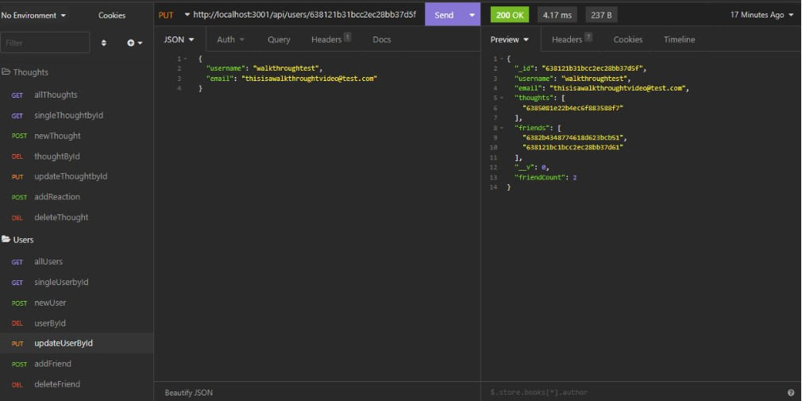

# Social-Network-API# 18 NoSQL: Social Network API

# Social Network API Challenge 18

  ## Description
  Demonstrate proficiency and coding expertise acquired throughout modules 1-18 by constructing an API for a social networking platform. This API enables users to post their thoughts, engage with their friends' thoughts, and establish connections with other users. The development encompasses the utilization of Express.js for routing, MongoDB as the database, Mongoose ODM for data modeling, and Moment.js for timestamp formatting.

## Table of Contents:
  * [Repository](#repository) 
  * [Demo](#demo)
  * [Installation](#installation)
  * [Usage](#usage)
  * [Screenshot](#screenshot)
  * [Test](#test)
  * [GitHub](#github)

  ## Repository
  Assignment 18 NoSQL: Challenge Social Network API

  ## Demo
  [Click Here to View Walk-Through Video 1](https://drive.google.com/file/d/1iDlWj2mdwvjE4nWr9kWw3W8eBBImRF-u/view?usp=sharing)
   [Click Here to View Walk-Through Video 2](https://drive.google.com/file/d/1CtQTDReC-JPxYBDhj1frPn5XBLDfcAbX/view?usp=sharing)

  ## Installation
  To install this application, clone down from repository.

  ## Usage
  After installation is completed, please open an integrated terminal, and use command 'npm i' to install any/all dependencies, then use command 'npm start' to begin.

  ## Screenshot
  

  ## License

This project is licensed under the MIT License. See the [LICENSE](LICENSE) file for details.
  
  ## Test
  No tests currently available. If users wish to test the program, they may use it as intended and give feedback.

  ## Questions

If you have any questions or need further assistance with this project, please don't hesitate to reach out to the project owner:

  ## GitHub
  [Lito Banano](https://github.com/hyperlitz)